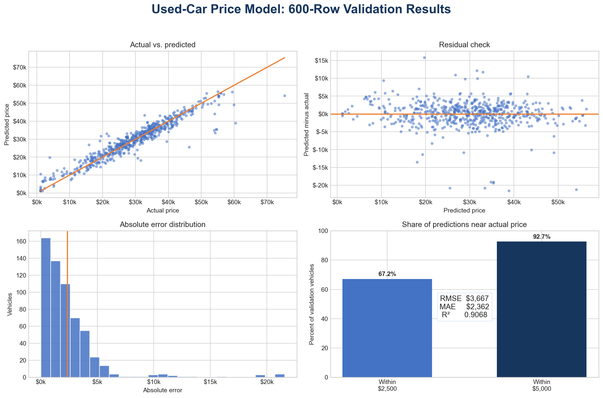
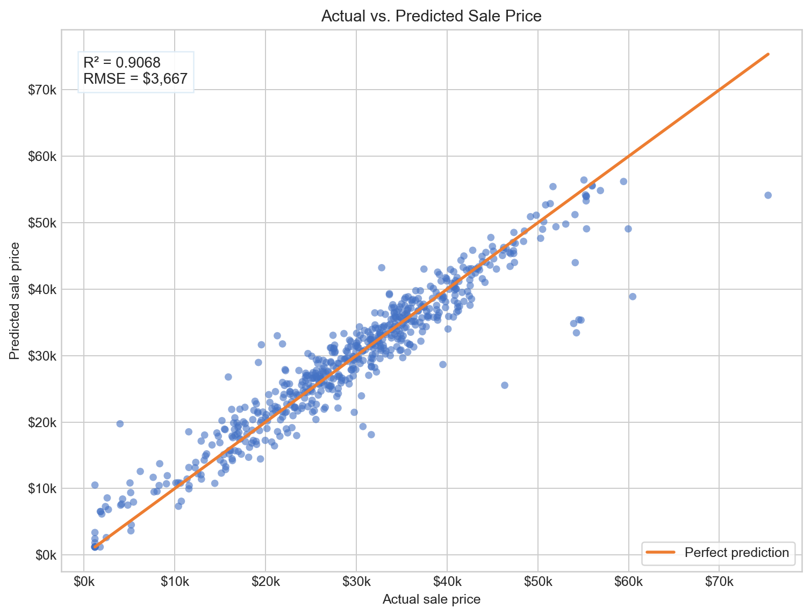
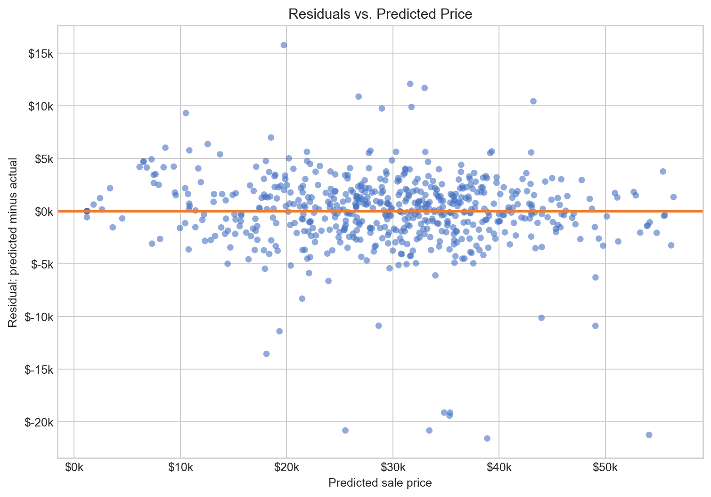
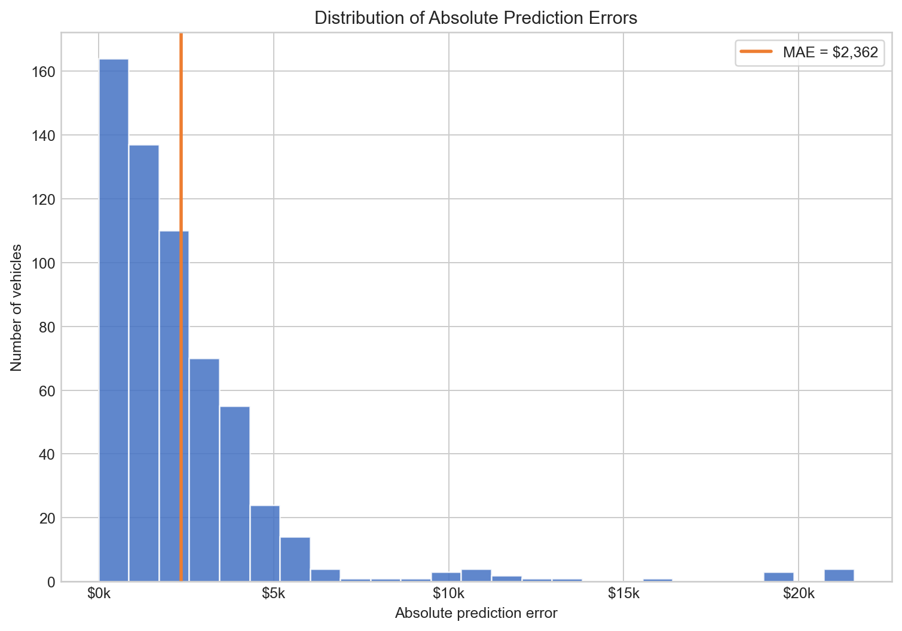

# 🚗 Used-Car Sale Price Regression — From-Scratch Linear Model

<a id="ai-disclosure"></a>
> ## 🚨 AI DISCLOSURE
> **This project was created solely with artificial-intelligence-generated output.** AI produced the model design, Python code, preprocessing strategy, validation analysis, visualizations, report, and documentation. We executed the programs, reviewed the results, tested the outputs, and prepared the presentation materials. The validation checks below document how the generated work was verified.

This project predicts `sale_price_usd` for used vehicles after inspection but before negotiation and financing. The full regression pipeline is implemented with Python, NumPy, and Matplotlib—without machine-learning packages, ready-made models, optimization libraries, least-squares solvers, matrix inverses, pseudoinverses, or polynomial-fitting shortcuts.



## 📖 Table of Contents

- [Project Objective](#project-objective)
- [Quick Start](#quick-start)
- [Dataset](#dataset)
- [Method](#method)
- [Experimental Design](#experimental-design)
- [Regularization](#regularization)
- [Results and Findings](#results-findings)
- [Visual Diagnostics](#visual-diagnostics)
- [Prediction Output](#prediction-output)
- [Git Safety](#git-safety)
- [Collaboration](#collaboration)
- [File Structure](#file-structure)
- [Limitations](#limitations)

<a id="project-objective"></a>
## 🎯 Project Objective

The model accepts a feature-only CSV and produces one finite sale-price prediction for every `listing_id`. IDs are used only to match outputs; they are never model inputs.

Prediction timing controls feature validity. Vehicle specifications, inspection results, history, region, and seller information are available. `loan_approval_value_usd` is excluded because it is created during financing, after the prediction should occur—even though it correlates strongly with sale price.

The final output contains exactly:

```text
listing_id,sale_price_usd_pred
```

<a id="quick-start"></a>
## ⚙️ Quick Start

### Requirements

- Python **3.12** (tested with Python 3.12.14)
- NumPy **2.3.5**
- Matplotlib **3.10.8**

Install dependencies from the repository root:

```bash
python3 -m pip install numpy==2.3.5 matplotlib==3.10.8
```

### Configure file locations

Near the top of `python_code/used_car_price_model.py`, set:

```python
TRAIN_PATH = Path("raw_csv/car_price_train.csv")
TEST_PATH = Path("sample_test/mock_instructor_test.csv")
OUTPUT_PATH = Path("predictions/predictions.csv")
CHART_DIRECTORY = Path("images/model_validation_charts")
```

Relative paths are resolved from the directory where the command is run, so run all commands from the repository root.

### Train, validate, and generate predictions

```bash
python3 python_code/used_car_price_model.py
```

The program runs a 600-row holdout evaluation, prints accuracy and convergence statistics, saves validation charts, refits on all labeled rows, and writes predictions for the configured test CSV.

### Run the presentation demo

Configure the paths in `python_code/used_car_price_demo.py`, then run:

```bash
python3 python_code/used_car_price_demo.py
```

<a id="dataset"></a>
## 📊 Dataset

The training data contains **1,800 listings and 19 columns**.

| Role | Column or group | Treatment |
|---|---|---|
| Identifier | `listing_id` | Output matching only |
| Target | `sale_price_usd` | Value predicted |
| Excluded leakage | `loan_approval_value_usd` | Unavailable before financing |
| Numeric predictors | 10 columns | Parse, impute, flag missingness, clip, expand, scale |
| Categorical predictors | 6 columns | Normalize and manually one-hot encode |

Important audit findings:

- Missing values occur in engine size, condition, service history, fuel type, and transmission.
- `odometer_km` reaches 3,228,000, indicating an extreme tail.
- 62 targets equal exactly `$1,200`, which is treated as a repeated price floor.
- Every `listing_id` is unique.

<a id="method"></a>
## 🧩 Method

Linear regression combines vehicle features using fitted weights. The program calculates its own mean squared error, gradients, and full-batch Adam updates with NumPy array arithmetic.

1. **Parse numeric text.** Invalid, infinite, and recognized missing tokens become missing values.
2. **Impute and flag.** Missing numbers receive the fitting-set median plus a missingness indicator.
3. **Limit extremes.** Values are clipped to fitting-set 0.5th and 99.5th percentiles.
4. **Encode categories.** Sorted training levels become manual one-hot columns.
5. **Add basis terms.** Squared features are combined with log and square-root odometer terms.
6. **Standardize.** Constructed features use fitting-set means and standard deviations.

`FeatureBuilder.fit()` stores the preprocessing recipe. `FeatureBuilder.transform()` reuses it, ensuring training, validation, and test matrices always contain the same **52 columns including the intercept**, in the same order.

| Optimization setting | Value |
|---|---:|
| Learning rate | `0.02` |
| Maximum iterations | `2,200` |
| Minimum iterations | `200` |
| Gradient tolerance | `2.5 × 10⁻⁴` |
| Selected L2 strength | `0.003` |

The estimator supports `model.fit(X_train, y_train)` and `model.predict(X_test)`.

<a id="experimental-design"></a>
## 🧪 Experimental Design

Model selection uses deterministic five-fold cross-validation. Each listing is validated once while the other 80% trains the model. All preprocessing values are relearned inside each fold using only that fold’s training rows.

A fixed 1,200/600 split provides an easy-to-explain presentation example and reproduces the expected new-file workflow. RMSE is the main selection metric because it is measured in dollars and gives larger errors more weight.

| Design | Strength | Limitation |
|---|---|---|
| Single holdout | Fast and easy to explain | Can be lucky or unlucky |
| Repeated holdouts | Shows split sensitivity | Rows may be evaluated unevenly |
| Five-fold CV | Every row is validated once | Requires five complete fits |

<a id="regularization"></a>
## 🛡️ L2 Regularization

The objective is ordinary MSE plus `λ × sum(w²)`. The intercept is not penalized. At `λ = 0`, the penalty and its gradient are zero, reproducing ordinary MSE; a numerical check returned a maximum gradient difference of `0.0`.

L2 is useful because several predictors overlap:

| Predictor pair | Pearson correlation |
|---|---:|
| `model_year` and `vehicle_age_years` | `-0.997955` |
| `engine_liters` and `horsepower` | `+0.822056` |
| `vehicle_age_years` and `condition_score` | `-0.775963` |
| `condition_score` and `service_history_score` | `+0.730071` |

| Lambda | Validation RMSE | Coefficient norm |
|---:|---:|---:|
| `0` | `$3,673.53` | `12,250.90` |
| `0.001` | `$3,669.60` | `10,938.80` |
| **`0.003`** | **`$3,667.36`** | **`9,739.70`** |
| `0.01` | `$3,675.96` | `8,266.84` |
| `0.1` | `$3,861.39` | `6,169.63` |

Across five folds, `λ = 0.003` changed mean RMSE from `$3,557.55` to `$3,557.22` while reducing the mean coefficient norm by about **20.9%**. It was retained for stability, not because it produced a meaningful accuracy improvement.

<a id="results-findings"></a>
## 📏 Results and Findings

| Holdout metric | Result | Meaning |
|---|---:|---|
| RMSE | `$3,667.36` | Emphasizes large misses |
| MAE | `$2,361.95` | Average absolute dollar miss |
| Median absolute error | `$1,724.84` | Half of predictions miss by less |
| R² | `0.9068` | About 90.7% of price variation explained |
| Within `$2,500` | `67.2%` | Roughly two-thirds of predictions |
| Within `$5,000` | `92.7%` | More than nine out of ten predictions |

Key findings:

1. Newer vehicles and lower vehicle age are among the strongest legitimate price signals.
2. Better condition and service history are associated with higher prices.
3. Greater mileage, more prior owners, and more accidents generally reduce value.
4. `loan_approval_value_usd` correlates approximately `+0.935` with price but is excluded as future information.
5. L2 substantially shrinks coefficients while leaving cross-validation RMSE nearly unchanged.
6. Most predictions are close, but several expensive vehicles remain difficult and are underpredicted.

<a id="visual-diagnostics"></a>
## 📈 Visual Diagnostics

### Actual vs. predicted prices

Points near the orange line indicate accurate predictions. Most listings follow it closely, while several high-price vehicles fall below it.



### Residuals

Residuals mostly center around zero, but the largest negative errors show where the model underpredicts unusual vehicles.



### Error distribution

Most absolute errors fall below `$5,000`; a small number of outliers create the long right tail.



<a id="prediction-output"></a>
## ✅ Prediction Output

`predictions/predictions.csv` must contain exactly two columns:

```text
listing_id,sale_price_usd_pred
MOCK-CAR-00001,24781.324615
```

The program checks for one row per test listing, nonblank unique IDs, finite predictions, and no extra columns.

<a id="git-safety"></a>
## 🔒 Git Safety

`.gitignore` excludes virtual environments, caches, temporary files, generated outputs, secrets, and private evaluation data. Keep external test files in `private_data/`, then verify before committing:

```bash
git check-ignore -v private_data/external_test.csv
git status
```

If a private file was already staged, keep it locally but remove it from Git tracking with `git rm --cached <path>`.

<a id="collaboration"></a>
## 🤝 Collaboration

| Collaborator | GitHub |
|---|---|
| **Mike Green** | `@mikegreen15` |
| **Nate Rivera** | `@the-rivernile` |

Collaboration included running and verifying the pipeline, reviewing preprocessing and leakage decisions, reproducing validation experiments, checking output files, preparing visualizations, and maintaining documentation.

<a id="file-structure"></a>
## 📁 File Structure

```text
├── images/
│   ├── demo_presentation_charts/
│   │   ├── 00_presentation_dashboard.png
│   │   ├── 01_actual_vs_predicted.png
│   │   ├── 02_residuals_vs_predicted.png
│   │   └── 03_absolute_error_distribution.png
│   └── model_validation_charts/
│       ├── 00_validation_dashboard.png
│       ├── 01_actual_vs_predicted.png
│       ├── 02_residuals_vs_predicted.png
│       └── 03_absolute_error_distribution.png
├── predictions/
│   ├── demo_predictions.csv
│   └── predictions.csv
├── python_code/
│   ├── used_car_price_demo.py
│   └── used_car_price_model.py
├── raw_csv/
│   └── car_price_train.csv
├── sample_test/
│   └── mock_instructor_test.csv
├── .gitignore
├── used_car_price_project_report.docx
└── README.md
```

<a id="limitations"></a>
## ⚠️ Limitations

- External labels are unavailable, so external-test accuracy cannot be measured locally.
- Mock rows verify the workflow but are not independent evidence of accuracy.
- Fixed basis terms cannot represent every nonlinear price relationship.
- Rare categories and high-price vehicles have limited training evidence.
- The repeated `$1,200` target is assumed to be a price floor.
- Validation estimates future performance but cannot guarantee identical results on new data.

---

This repository demonstrates a reproducible, leakage-aware regression pipeline built under strict from-scratch modeling constraints.
